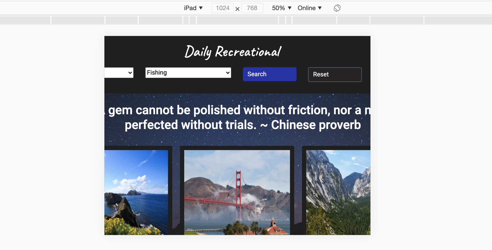

# uofm-bootcamp-project1
Project 1
Participants: Kyle Kleven, Carolyn Hilpisch, Chris Boisjoli, AsliFarah

Requirements: 

We started the initial project by voting on an app to create, assigning a project manager (Kyle), and dividing the tasks between the front end(Chris and Asli) and the back end (Kyle and Carolyn).  
We followed up with a Trello board.   Everyone had access to the board and could create, move, and modify the cards.

We used the board to create the beginning tasks necessary to start the project.  

# Daily Recreational
We chose the name of Daily Recreational for our project.   

# Description
Daily Recreational is here to inspire you to get out of the house and rekindle your love for outdoor activities. Daily Recreational provides you with an inspirational quote to brighten your day, paired with useful information on National Parks based on your desired state and activity. Whether you like birdwatching or mountain climbing, the Daily Recreational is your source for getting in a positively active mindset.

# Visuals
One of the major requirements was a responsive site.   Below are different sized versions.
Laptop:

iPad:

iPhone:

# Usage
Use examples liberally, and show the expected output if you can. It's helpful to have inline the smallest example of usage that you can demonstrate, while providing links to more sophisticated examples if they are too long to reasonably include in the README.

# Support
Tell people where they can go to for help. It can be any combination of an issue tracker, a chat room, an email address, etc.

# Roadmap
For the future, we have ideas to expand this app.  We would like to incorporate more local events, to include but not be limited to,state and local parks.   Along with more places we would like to use a zip code radius to show the closest activities and return them in ascending order of proximity. With all of the additional information, collpsable cards would be beneficial to hold more information on the page.  Additionally we would like to incorprate equipment rental and traveler tips that are specific to adventures offered at each location.  Eventually we would like to expand to an international app and include more inspirational and entertaining quotes.

# Authors and acknowledgment
Show your appreciation to those who have contributed to the project.

# License
For open source projects, say how it is licensed.